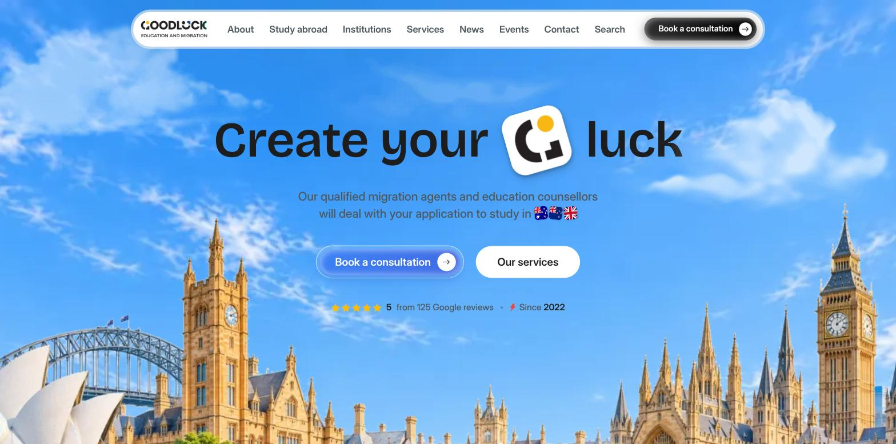
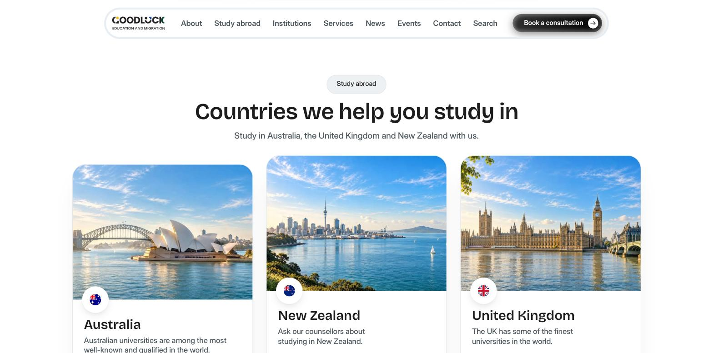

# Goodluck Education & Migration

The website for Goodluck Education & Migration, an education and migration consultancy with
offices in Melbourne, Butwal and Cebu. Public site, admin panel and API in one Next.js app, with
the database layer in its own package.

Live: https://goodluck-butwal.vercel.app



## What it does

- **Public site.** Study destinations, services, institutions, courses, IELTS and PTE preparation,
  news, events, team, offices and success stories. The header picks the visitor's office from a
  saved choice or their timezone, and the office drives phone numbers, team and events.
- **Enquiries and consultations.** Forms post to the API, are bot-checked with Turnstile, rate
  limited, and emailed to the right office.
- **Admin panel** at `/admin`. Staff sign in with email and password. Roles scope what each
  person can see and edit: a super admin sees everything, office admins see their own office,
  editors write but cannot publish.
- **Media.** Uploads go to Cloudinary. The static images under `public/` are served through the
  same CDN with automatic format and size.



## Stack

| Layer | Choice |
| --- | --- |
| Framework | Next.js 16, React 19, Tailwind 4 |
| Database | Neon Postgres over the HTTP driver, Drizzle ORM |
| Auth | Better Auth, email and password |
| Motion | Motion, Lenis on desktop |
| Media | Cloudinary |
| Email | Resend |
| Hosting | Vercel |
| Tests | Vitest |

## Layout

```
apps/web/        the Next.js app: routes, features, components, seed scripts, tests
packages/db/     @goodluck/db: schema, Neon client, migrations, local Postgres
```

`apps/web/src/features/` holds one folder per business area, each with its public queries,
admin queries, server actions and components. `packages/db/src/schema/` is the source of truth
for the database.

## Running it locally

Needs Node 22, pnpm 11 and Docker.

```bash
pnpm install
docker compose -f packages/db/docker-compose.yml up -d   # Postgres plus a proxy that speaks Neon's protocol
cp apps/web/.env.example apps/web/.env.local             # then fill it in
pnpm db:migrate:dev                                      # apply every migration to the fresh database
pnpm db:seed:dev                                         # content plus placeholder catalogue rows
pnpm dev
```

The app only talks Neon's HTTP protocol, so the proxy is what makes a plain local Postgres
reachable. Development and production run the same driver and the same client code.

## Commands

All of these run from the repository root.

| Command | What it does |
| --- | --- |
| `pnpm dev` | Development server |
| `pnpm build` | Production build, the same one Vercel runs |
| `pnpm typecheck` | Types only, across both packages |
| `pnpm lint` | ESLint |
| `pnpm test` | Vitest. Database tests stand aside when `DATABASE_URL` is unset |
| `pnpm db:migrate:dev` | Apply every migration to the local database |
| `pnpm db:migrate:prod` | Apply pending migrations to production |
| `pnpm db:seed:dev` | Seed the local database |
| `pnpm db:seed:prod` | Seed production with the real content only |
| `pnpm assets:upload` | Push `public/` images to Cloudinary. `--force` overwrites |

## Deploying

Push to `main`. Vercel builds and releases the app from `apps/web`, and the migrate workflow
applies pending migrations from the same push. CI runs typecheck, lint, tests and a build on every
pull request against a seeded database.

## More

- `apps/web/docs/technical-handover.md`: how it runs, where the environment lives, what to do
  when something breaks
- `apps/web/docs/admin-guide.md`: for staff using the admin
- `apps/web/docs/recovery.md`: restoring the database and media from backup
- `skill.md`: the full map of the codebase for agents and new developers
